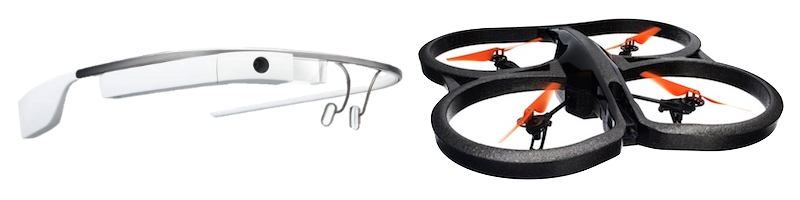

Glass Quadcopter Commander
==========================

Google Glass application to fly an AR.Drone quadcopter.

## Prerequisites
* In your computer, install [Android Studio](http://developer.android.com/sdk/installing/studio.html) or
[Android Developer Tools (ADT)](http://developer.android.com/sdk/installing/bundle.html).
* In Google Glass, install (deploy) [Launchy](https://github.com/kaze0/launchy), so you can easily launch other 
installed Android applications from the Glass Settings.

If you need more specific details read [prerequisites](prerequisites.md).
