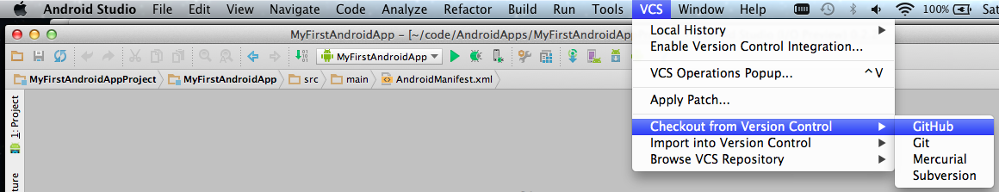
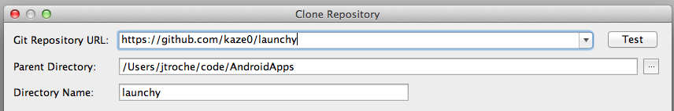

# Prerequisites
* In your computer, install [Android Studio](http://developer.android.com/sdk/installing/studio.html) 
or [Android Developer Tools (ADT)] (http://developer.android.com/sdk/installing/bundle.html).
From now on, the instructions are for Android Studio, but the steps are similar for ADT.
* Check out the [launchy source code](https://github.com/kaze0/launchy) from github and import as 
project in Android Studio. There is a few ways to do that, just one of them is detailed below.
  * In Android Studio go to menu `VCS > Checkout from Version Control > GitHub`
  
  
  * Fill the Git Repository URL with https://github.com/kaze0/launchy. The other fields will be 
  automatically populated. Clone the repository.

  
